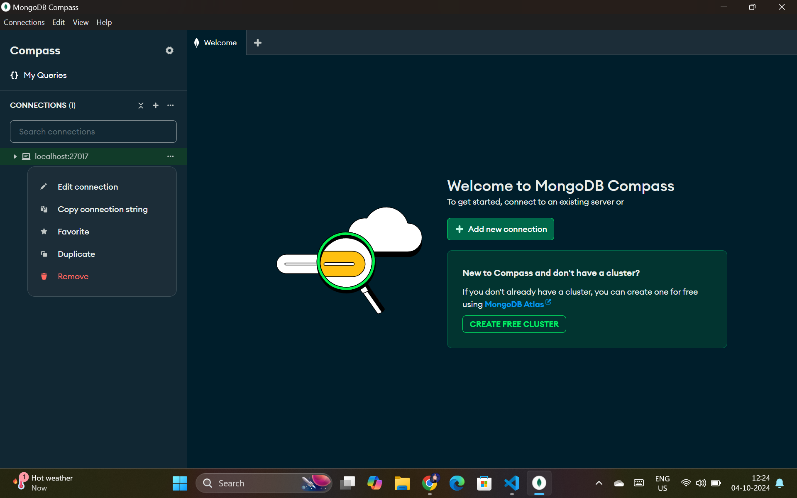

# Using MongoDB With ExpressJS

```mongoose``` is a nodejs package that can be used to connect your express application with mongodb.

## Installing mongooose
```bash
pnpm add mongoose
```

## Importing mongoose
```js
// Using commonjs imports
const mongoose = require('mongoose');
// Using ES6 imports
// import mongoose from "mongoose";
```

## Creating a connection with mongodb
We need to create a separate file called ```db.js``` and export the ```connectDB``` function.



```js
const mongoose = require('mongoose');

const connectDB = async () => {
    await mongoose.connect('mongodb://localhost:27017/devopslakshyaraj');
    console.log('Connected to mongodb !!', mongoose.connections[0].host);
}
// Using commonjs exports
module.exports = connectDB;
// Using es6 exports
// export default connectDB;
```

## Import the connectDB function
```js
// Using commonjs imports
const connectDB = require('./db');
// Using ES6 imports
// import connectDB from "./db.js";
```

## Creating Schemas
Schemas define the structure of the documents stored in database.
```js
const mongoose = require('mongoose');
const { Schema } = mongoose;

const userSchema = new Schema({
    name: String,
    username: String,
    email: String,
    address: {
        street: String,
        suite: String,
        city: String,
        zipcode: String,
        geo: {
            lat: String,
            lng: String
        }
    },
    phone: String,
    website: String,
    company: {
        name: String,
        catchPhrase: String,
        bs: String
    }
});

// Using commonjs exports
module.exports = {
    Users: mongoose.model('users', userSchema)
}

// Using es6 exports
// export const Users = mongoose.model('users', userSchema)
```
